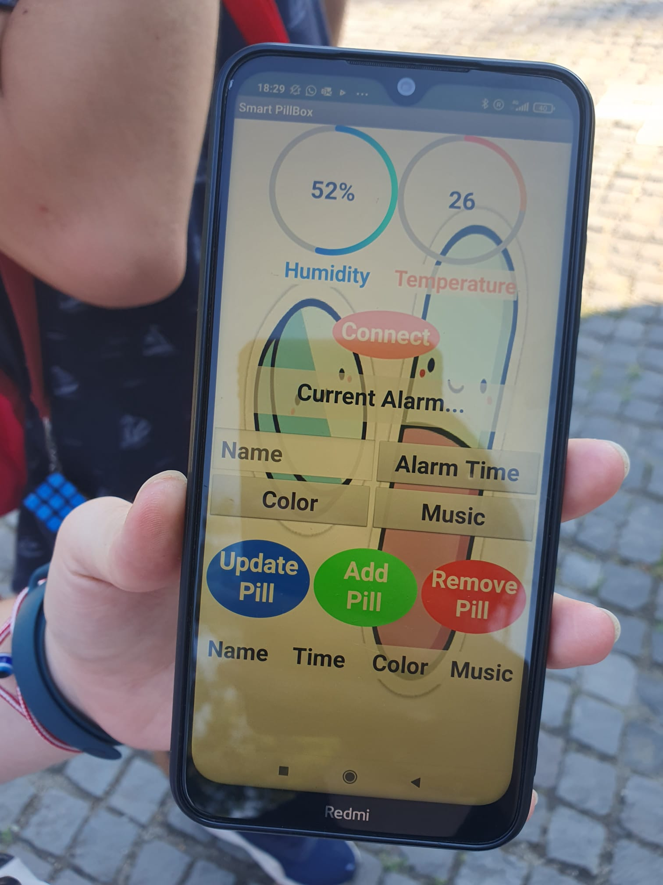
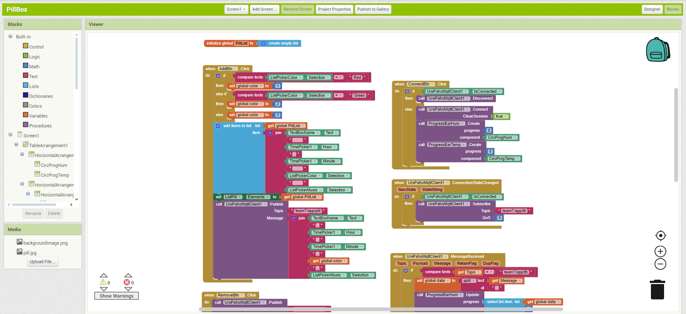
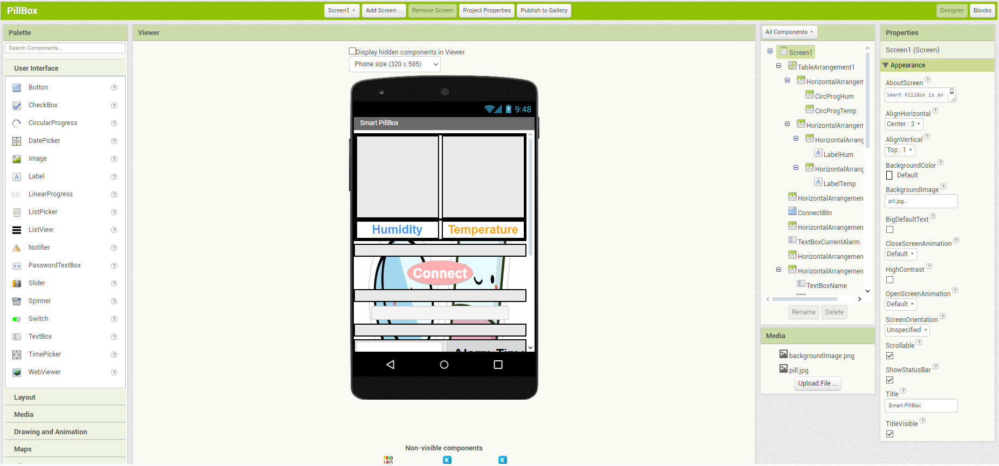
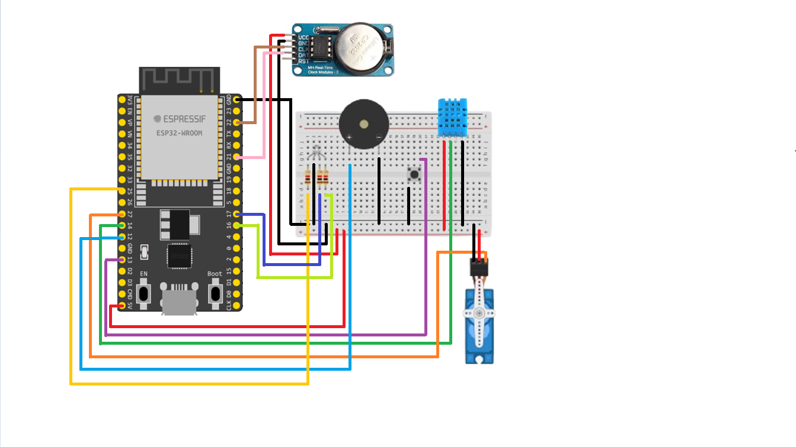
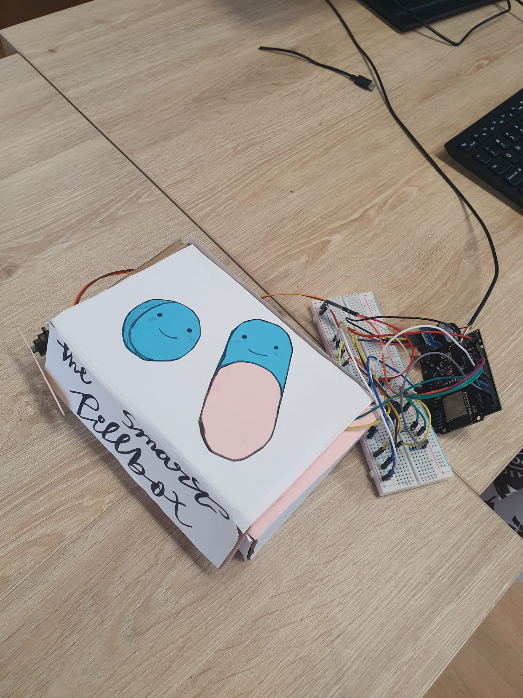

# SmartPillbox

## Contents
  - [Description](#description)
  - [Setting](#Setting)
  - [Libraries](#libraries)
  - [App](#app)
  - [Components](#components)
  - [Circuit Schematic](#circuit-schematic)
  - [Prototype](#prototype)

---

## Description

Smart Pillbox manages to help senior citizens and chronic sufferer with pill dosage schedule by combining the usage of a microcontroller and a mobile app to adjust the doses they need to take associating a color, a tone(optional), and a time for each tablet intake.

This allows to include people who may have visual disabilities (due to the large letters and the music) and hearing disabilities (the color). 
The use of MQTT communication allows to easily send and receive information in a bidirectional way. (The information about the pill is sent from the app to the board and the humidity and temperature from the board to the app. We also send to the app the name of the pill to be taken to remember it)

Once the information has been added, we press the add pill button and the information would be sent via MQTT to the board and would be saved in a list of pills that would be shown in the table below. If we want to delete any pills we have to select them and press the remove pill button, finally if we want to update any data on any pill we would select the data to change and press update pill.

The temperature and humidity is measured to control the state of the pills in case they need specific conditions And in case someone needs to know the conditions of their environment for personal needs.

The servo motor allows to close the box so that it cannot be opened when it is not time to take the pill, thus avoiding taking more pills than necessary. 

When the time comes, the music starts to play, the RGB lights up and the box opens. When the pills have been taken, a button has to be pressed and everything stops and after 10 seconds the servo closes. 

There are different tasks: one to check the current time with the timer in case an alarm needs to be activated, another to activate the alarms, another for the humidity and temperature, and another for the LED so that they can work simultaneously, in addition to protected variables (to avoid race conditions). 

In addition, if we add different pills at the same time, they would be added to a queue and would sound one after another, thus avoiding skipping a pill.

What's more, this prototype is sustainable as the material is recycled cardboard and can be expanded easily without buying more electronic components.

 

---

## Setting

The code has been developed in the Arduino integrated development environment, [Arduino IDE](https://www.arduino.cc/en/software), and the app using [MIT App Inventor](https://appinventor.mit.edu). To establish the MQTT communication, the [MQTTX](https://mqttx.app/downloads) program is recommended, although any other program can be used.

 

		
		
		

 

---

## Libraries

Once the programs are installed, download the following libraries:
* `esp32` by Espressif Systems (Boards Manager): [download](https://docs.espressif.com/projects/arduino-esp32/en/latest/installing.html)
* `Adafruit BusIO` by Adafruit (Library Manager): [download](https://github.com/adafruit/Adafruit_BusIO)
* `Adafruit Unified Sensor` by Adafruit (Library Manager): [download](https://github.com/adafruit/Adafruit_Sensor)
* `DHT sensor library` by Adafruit (Library Manager): [download](https://github.com/adafruit/DHT-sensor-library)
* `RTClib` by Adafruit (Library Manager): [download](https://github.com/adafruit/RTClib)
* `ESP32Servo` by Kevin Harrington,John K. Bennett (Library Manager): [download](https://github.com/madhephaestus/ESP32Servo)
* `PubSubClient` by Nick O'Leary (Library Manager): [download](https://github.com/knolleary/pubsubclient/releases/tag/v2.8)
* `pitches.h` by Nick O'Leary (Library Manager): [download](https://github.com/arduino/arduino-examples/blob/main/examples/02.Digital/toneMelody/pitches.h)

 

---

## App

To use the app, [download](./app/PillBox.apk) in your mobile phone and click on the downloadedfile. To modify the app, download this [code](./app/PillBox.aia) in the desktop version of MIT App Inventor.

 

		

 

		

 

		

 

---

## Components

Here is the list of needed components: 
* `ESP32 Dev Module`
* `DHT11 sensor`
* `Servomotor`
* `Button`
* `RTC`
* `RGB LED`
* `Active Buzzer`
* `3 x 220R Resistors`

 

---

## Circuit Schematic

Below is an image of the circuit assembly schematic: 

 

		

 

---

## Prototype

The above assembly is placed next to/inside the box as follows:

 

		

 

                 
     <a href="https://drive.google.com/file/d/1dfI8LhsQOu0Xw-bCbGQ_XU2m1PqXq06b/view?usp=sharing">Prototype Video</a>

 
